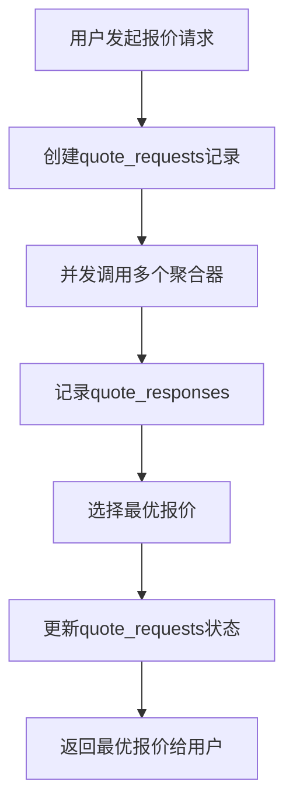
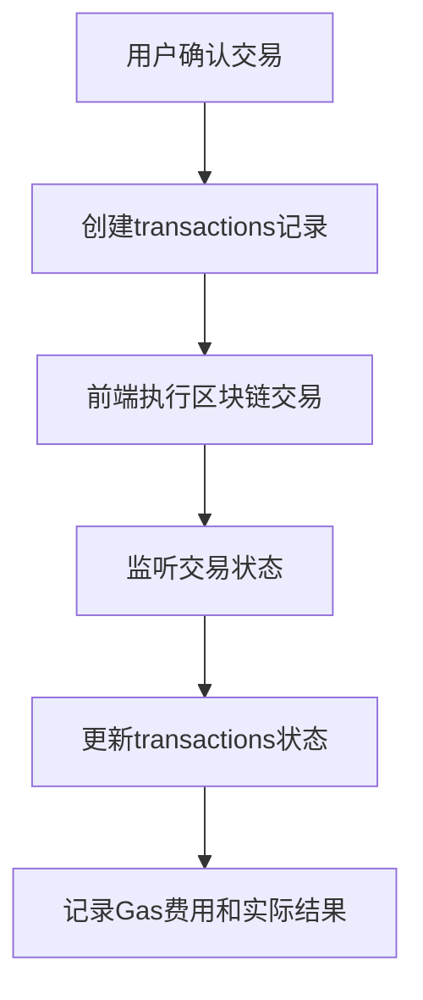

# DeFi聚合器数据库设计文档

## 📋 概述

本目录包含DeFi聚合器项目的完整数据库设计，基于PostgreSQL 15+，支持企业级DeFi聚合器的所有核心功能。

## 🗂️ 文件结构

```
database/
├── README.md                    # 本文档
├── schema.sql                   # 完整数据库架构
├── migrations/                  # 数据库迁移文件
│   └── 001_initial_schema.sql  # 初始架构迁移
└── seed_data.sql               # 初始数据种子
```

## 🏗️ 数据库架构设计

### **核心设计原则**

1. **业务驱动**: 严格按照DeFi聚合器业务流程设计表结构
2. **性能优化**: 合理的索引策略和查询优化
3. **数据完整性**: 完善的约束和外键关系
4. **可扩展性**: 支持多链、多聚合器扩展
5. **审计追踪**: 完整的操作日志和时间戳

### **表结构概览**

#### **1. 基础配置表**
- `chains` - 支持的区块链网络
- `aggregators` - 第三方聚合器配置
- `aggregator_chains` - 聚合器支持的链关系
- `tokens` - 支持的代币信息

#### **2. 用户管理表**
- `users` - 用户基础信息
- `user_preferences` - 用户偏好设置

#### **3. 报价相关表**
- `quote_requests` - 报价请求记录
- `quote_responses` - 聚合器响应详情

#### **4. 交易相关表**
- `transactions` - 交易记录

#### **5. 统计监控表**
- `aggregator_stats_hourly` - 聚合器性能统计
- `token_pair_stats_daily` - 代币对交易统计
- `system_metrics` - 系统监控指标

## 🔄 核心业务流程数据流

### **1. 用户报价请求流程**



**涉及的表**:
- `quote_requests`: 记录请求参数和最终结果
- `quote_responses`: 记录每个聚合器的响应详情
- `users`: 用户信息 (如果已登录)
- `tokens`: 源代币和目标代币信息
- `aggregators`: 聚合器配置信息

### **2. 用户交易执行流程**



**涉及的表**:
- `transactions`: 完整的交易记录
- `quote_requests`: 关联的报价请求
- `users`: 用户信息
- `tokens`: 交易代币信息

## 📊 数据表详细设计

### **核心表结构分析**

#### **quote_requests 表**
```sql
-- 报价请求表 - 业务核心表
CREATE TABLE quote_requests (
    id                  SERIAL PRIMARY KEY,
    request_id          VARCHAR(64) UNIQUE NOT NULL,       -- 唯一请求ID
    user_id             INTEGER REFERENCES users(id),      -- 用户ID (可为空，支持匿名)
    chain_id            INTEGER REFERENCES chains(id) NOT NULL,
    from_token_id       INTEGER REFERENCES tokens(id) NOT NULL,
    to_token_id         INTEGER REFERENCES tokens(id) NOT NULL,
    amount_in           DECIMAL(78,0) NOT NULL,            -- 输入数量 (wei格式)
    slippage            DECIMAL(5,4) NOT NULL,             -- 滑点设置
    -- ... 其他字段
);
```

**设计考量**:
- `amount_in` 使用 `DECIMAL(78,0)` 支持wei格式的大整数
- `request_id` 使用UUID格式保证全局唯一性
- `user_id` 可为空支持匿名用户使用
- 完整的索引策略支持高频查询

#### **transactions 表**
```sql
-- 交易记录表 - 核心业务表
CREATE TABLE transactions (
    id                  SERIAL PRIMARY KEY,
    user_id             INTEGER REFERENCES users(id),
    quote_request_id    INTEGER REFERENCES quote_requests(id), -- 关联报价请求
    tx_hash             VARCHAR(66) UNIQUE,                -- 交易哈希
    -- 交易参数
    amount_in           DECIMAL(78,0) NOT NULL,            -- 实际输入数量
    amount_out_expected DECIMAL(78,0) NOT NULL,            -- 预期输出数量
    amount_out_actual   DECIMAL(78,0),                     -- 实际输出数量
    -- Gas相关
    gas_limit           BIGINT,                            -- Gas限制
    gas_used            BIGINT,                            -- 实际使用Gas
    gas_price           BIGINT,                            -- Gas价格 (wei)
    -- ... 其他字段
);
```

**设计考量**:
- 区分预期和实际输出数量，便于滑点分析
- 详细的Gas信息记录，支持成本分析
- 与报价请求的关联关系，便于用户行为分析

### **索引策略**

#### **查询优化索引**
```sql
-- 高频查询优化
CREATE INDEX idx_quote_requests_user_created ON quote_requests(user_id, created_at DESC);
CREATE INDEX idx_transactions_user_status ON transactions(user_id, status);
CREATE INDEX idx_tokens_chain_active ON tokens(chain_id, is_active);

-- 业务分析索引  
CREATE INDEX idx_quote_requests_token_pair_time ON quote_requests(from_token_id, to_token_id, created_at);
CREATE INDEX idx_transactions_aggregator_time ON transactions(aggregator_id, created_at);
```

#### **复合索引策略**
- 用户相关查询: `(user_id, created_at DESC)`
- 代币对分析: `(from_token_id, to_token_id, date)`
- 聚合器性能: `(aggregator_id, timestamp)`

## 🔧 数据库操作指南

### **环境搭建**

#### **1. 安装PostgreSQL**
```bash
# macOS
brew install postgresql@15

# Ubuntu
sudo apt install postgresql-15

# Docker
docker run --name defi-postgres \
  -e POSTGRES_DB=defi_aggregator \
  -e POSTGRES_USER=admin \
  -e POSTGRES_PASSWORD=password \
  -p 5432:5432 \
  -d postgres:15
```

#### **2. 创建数据库**
```bash
# 连接PostgreSQL
psql -h localhost -U admin -d postgres

# 创建数据库
CREATE DATABASE defi_aggregator;
\c defi_aggregator;
```

#### **3. 执行迁移**
```bash
# 执行初始架构迁移
psql -h localhost -U admin -d defi_aggregator -f migrations/001_initial_schema.sql

# 插入种子数据
psql -h localhost -U admin -d defi_aggregator -f seed_data.sql
```

### **常用查询示例**

#### **用户交易统计**
```sql
-- 查询用户交易统计
SELECT 
    u.wallet_address,
    COUNT(t.id) as total_transactions,
    SUM(CASE WHEN t.status = 'confirmed' THEN t.amount_in_usd ELSE 0 END) as total_volume,
    AVG(CASE WHEN t.status = 'confirmed' THEN t.gas_fee_usd END) as avg_gas_fee
FROM users u
LEFT JOIN transactions t ON u.id = t.user_id
WHERE u.created_at >= '2024-01-01'
GROUP BY u.id, u.wallet_address
ORDER BY total_volume DESC;
```

#### **聚合器性能分析**
```sql
-- 聚合器响应时间和成功率统计
SELECT 
    a.name,
    COUNT(qr.id) as total_responses,
    AVG(qr.response_time_ms) as avg_response_time,
    COUNT(CASE WHEN qr.success = true THEN 1 END) * 100.0 / COUNT(qr.id) as success_rate
FROM aggregators a
LEFT JOIN quote_responses qr ON a.id = qr.aggregator_id
WHERE qr.created_at >= CURRENT_DATE - INTERVAL '7 days'
GROUP BY a.id, a.name
ORDER BY success_rate DESC;
```

#### **热门代币对分析**
```sql
-- 最近7天热门交易对
SELECT 
    ft.symbol as from_token,
    tt.symbol as to_token,
    COUNT(qr.id) as quote_count,
    COUNT(t.id) as transaction_count,
    SUM(CASE WHEN t.status = 'confirmed' THEN t.amount_in_usd ELSE 0 END) as total_volume
FROM quote_requests qr
JOIN tokens ft ON qr.from_token_id = ft.id
JOIN tokens tt ON qr.to_token_id = tt.id
LEFT JOIN transactions t ON qr.id = t.quote_request_id
WHERE qr.created_at >= CURRENT_DATE - INTERVAL '7 days'
GROUP BY ft.symbol, tt.symbol
HAVING COUNT(qr.id) >= 10
ORDER BY total_volume DESC
LIMIT 20;
```

### **性能监控查询**

#### **系统健康检查**
```sql
-- 检查各表数据量和最近活动
SELECT 
    schemaname,
    tablename,
    n_tup_ins as inserts,
    n_tup_upd as updates,
    n_tup_del as deletes,
    n_live_tup as live_rows
FROM pg_stat_user_tables
ORDER BY n_live_tup DESC;
```

#### **慢查询分析**
```sql
-- 查询执行统计
SELECT 
    query,
    calls,
    total_time,
    mean_time,
    rows
FROM pg_stat_statements
WHERE query LIKE '%quote_requests%'
ORDER BY mean_time DESC
LIMIT 10;
```

## 🛡️ 数据安全和备份

### **数据备份策略**
```bash
# 完整备份
pg_dump -h localhost -U admin -d defi_aggregator > backup_$(date +%Y%m%d).sql

# 仅数据备份
pg_dump -h localhost -U admin -d defi_aggregator --data-only > data_backup_$(date +%Y%m%d).sql

# 仅架构备份
pg_dump -h localhost -U admin -d defi_aggregator --schema-only > schema_backup_$(date +%Y%m%d).sql
```

### **数据恢复**
```bash
# 从备份恢复
psql -h localhost -U admin -d defi_aggregator_new < backup_20241201.sql
```

## 📈 扩展计划

### **短期优化**
1. **分区表**: 对大表 (`transactions`, `quote_requests`) 按时间分区
2. **读写分离**: 主从复制配置
3. **连接池**: 配置PgBouncer连接池

### **长期扩展**
1. **分库分表**: 按链ID进行水平分片
2. **数据归档**: 历史数据迁移到时序数据库
3. **多云部署**: 跨云容灾备份

---

**注意**: 本数据库设计完全基于DeFi聚合器的业务需求，确保数据完整性和查询性能。在生产环境中请根据实际QPS和数据量进行相应的性能调优。
